# Chart Synthesizer

<p float="left">
    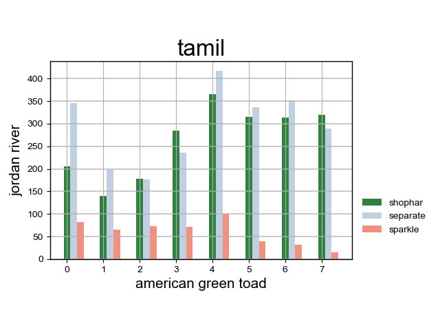
    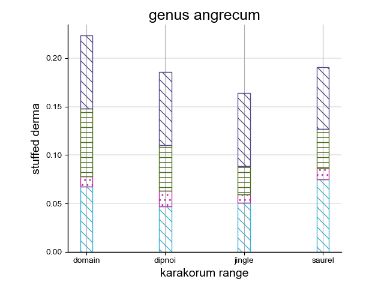
    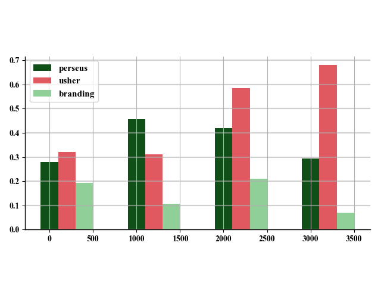
    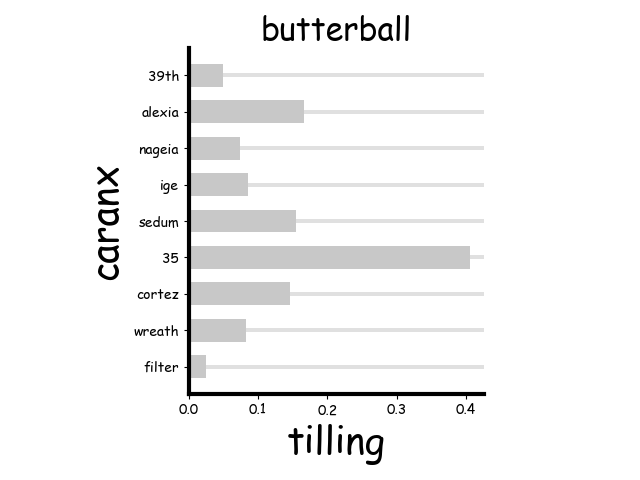
    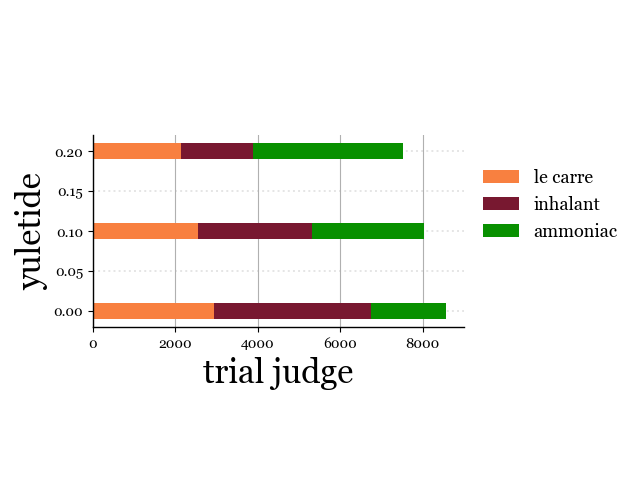
    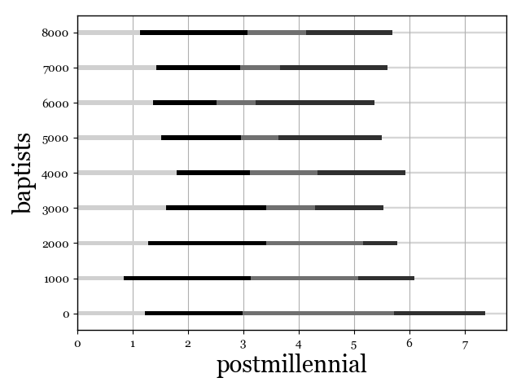
</p>
<p float="left">
    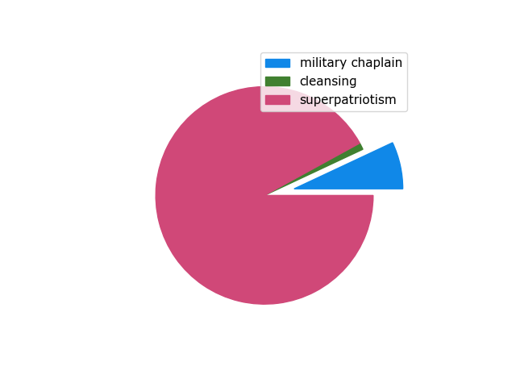
    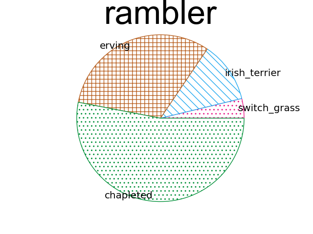
    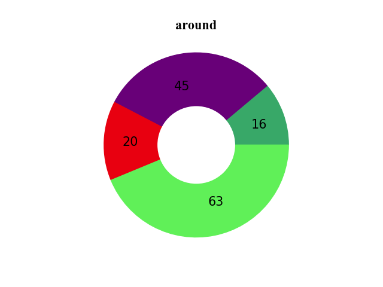
    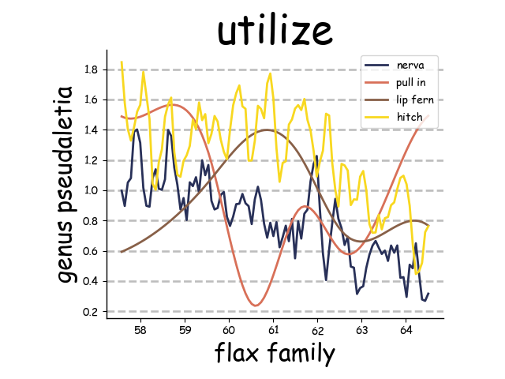
    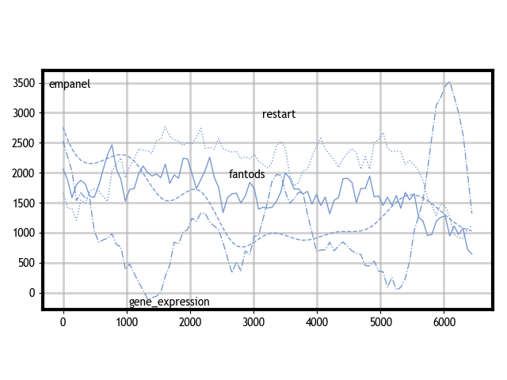
    
</p>

This repository contains scripts to synthesize vertical bar charts, horizontal bar charts, pie charts and line charts as pairs of images (PNG) and their annotations (JSON), which are used for the WACV2022 paper [Parsing Line Chart Images Using Linear Programming](https://openaccess.thecvf.com/content/WACV2022/html/Kato_Parsing_Line_Chart_Images_Using_Linear_Programming_WACV_2022_paper.html).

Numerical data, colors, styles and layouts are randomly determined.

Texts in charts are also randomly generated using [Japanese Wordnet (vXX) © 2009-2011 NICT, 2012-2015 Francis Bond and 2016-2017 Francis Bond, Takayuki Kuribayashi](http://compling.hss.ntu.edu.sg/wnja/index.en.html).

If you use the scripts for your paper, please cite:
 
```
@InProceedings{Kato_2022_WACV,
    author    = {Kato, Hajime and Nakazawa, Mitsuru and Yang, Hsuan-Kung and Chen, Mark and Stenger, Bj\"orn},
    title     = {Parsing Line Chart Images Using Linear Programming},
    booktitle = {Proceedings of the IEEE/CVF Winter Conference on Applications of Computer Vision (WACV)},
    month     = {January},
    year      = {2022},
    pages     = {2109-2118}
}
```

## Requirements

- Python 3.9
- pipenv (Optional)
- wnjpn.db (Download from [here](http://compling.hss.ntu.edu.sg/wnja/data/1.1/wnjpn.db.gz) and put the db file in this project's directory)

## Setup

```bash
cd chart-synthesizer

# Option1: w/ Pipenv
pipenv install
pipenv shell

# Option2: w/o Pipenv
pip install -r requierments.txt
```

## Run

```bash
# Synthesize vertical bar charts
python synthesize_bar_charts.py --num 100 --output vbars

# Synthesize horizontal bar charts
python synthesize_bar_charts.py --horz --num 100 --output hbars

# Synthesize pie charts
python synthesize_pie_charts.py --num 100 --output pies

# Synthesize line charts
python synthesize_line_charts.py --num 100 --output lines
```

Synthesized chart images and annotations are generated in the specified output directory.

Each generated image is in PNG format, along with its associated JSON annotation with the same file name.

## SYN dataset

SYN dataset, used for the experiments in our [WACV2022 paper](https://openaccess.thecvf.com/content/WACV2022/html/Kato_Parsing_Line_Chart_Images_Using_Linear_Programming_WACV_2022_paper.html), is available [here](https://rit.rakuten.com/data_release/).

## Data format

### Bar charts

```json
{
    "name": "0", // Chart name
    "type": "vbar", // Chart type: vbar (vertical bar charts) or hbar (horizontal bar charts)
    "data": { // Annotation data
        "title": { // Chart title
            "value": "sample vertical bar chart", // Text content
            "x0": 167, // Top left x-coordinate of bounding box
            "y0": 1, // Top left y-coordinate of bounding box
            "x1": 491, // Bottom right x-coordinate of bounding box
            "y1": 32 // Bottom right y-coordinate of bounding box
        }, // null if none
        "xaxis": { // x-axis
            "start": { "x": 34, "y": 454 }, // Leftmost coordinate of x-axis
            "end": { "x": 625, "y": 454 }, // Rightmost coordinate of x-axis
            "ticks": [ // Coordinates of tick marks
                {"x": 98, "y": 454},
                {"x": 164, "y": 454},
                {"x": 230, "y": 454},
                {"x": 296, "y": 454},
                {"x": 362, "y": 454},
                {"x": 428, "y": 454},
                {"x": 494, "y": 454},
                {"x": 561, "y": 454}
            ],
            "tick_labels": [ // Tick labels in the same order as "ticks"
                {"value": "\u221220", "x0": 84, "y0": 464, "x1": 111, "y1": 478},
                {"value": "0", "x0": 159, "y0": 464, "x1": 168, "y1": 478},
                {"value": "20", "x0": 221, "y0": 464, "x1": 239, "y1": 478},
                {"value": "40", "x0": 287, "y0": 464, "x1": 305, "y1": 478},
                {"value": "60", "x0": 353, "y0": 464, "x1": 372, "y1": 478},
                {"value": "80", "x0": 419, "y0": 464, "x1": 438, "y1": 478},
                {"value": "100", "x0": 480, "y0": 464, "x1": 508, "y1": 478},
                {"value": "120", "x0": 547, "y0": 464, "x1": 575, "y1": 478}
            ],
            "title": "foo" // Title of x-axis (null if none)
        },
        "yaxis": { // y-axis
            "start": {"x": 34, "y": 454}, // Bottom coordinate of y-axis
            "end": {"x": 34, "y": 34}, // Top coordinate of y-axis
            "ticks": [
                {"value": "0", "x": 34, "y": 364},
                {"value": "1", "x": 34, "y": 274},
                {"value": "2", "x": 34, "y": 184},
                {"value": "3", "x": 34, "y": 94}
            ],
            "tick_labels": [
                {"value": "0", "x0": 15, "y0": 449, "x1": 24, "y1": 463},
                {"value": "1", "x0": 15, "y0": 359, "x1": 24, "y1": 373},
                {"value": "2", "x0": 15, "y0": 269, "x1": 24, "y1": 283},
                {"value": "3", "x0": 15, "y0": 178, "x1": 24, "y1": 192},
                {"value": "4", "x0": 15, "y0": 88, "x1": 24, "y1": 102}
            ],
            "title": null
        },
        "stacked": true, // Whether bars are stacked or not
        "bars": [ // Bar groups
            {
                "bar": [ // bars in the same bar group
                    {
                        "x0": 60, // Top left x-coordinate of bar
                        "y0": 56, // Top left y-coordinate of bar
                        "x1": 267, // Bottom right x-coordinate of bar
                        "y1": 454, // Bottom right y-coordinate of bar
                        "value": {
                            "x": 0.0, // Corresponding x-axis value
                            "y": 4.4247690372199955, // Corresponding y-axis value
                            "label": {"value": "foo", "x0": 70, "y0": 20, "x1": 150, "y1": 50} // Bar label (null if none)
                        }
                    },
                    {
                        "x0": 391,
                        "y0": 54,
                        "x1": 598,
                        "y1": 454,
                        "value": {
                            "x": 100.0,
                            "y": 4.448282208671728,
                            "label": null
                        }
                    }
                ],
                "legend": { // Legend
                    "icon": { // Legend icon
                        "x0": 399,
                        "y0": 72,
                        "x1": 429,
                        "y1": 83
                    },
                    "label": { // Legend label
                        "x0": 442,
                        "y0": 71,
                        "x1": 499,
                        "y1": 87,
                        "value": "borough"
                    }
                } // null if none
            }
        ]
    }
}
```

### Pie charts

```json
{
    "name": "0", // Chart name
    "type": "pie", // Chart type (pie only)
    "data": { // Annotation data
        "title": { // Chart title
            "value": "paul von hindenburg", // Text content
            "x0": 111, // Top left x-coordinate of bounding box
            "y0": 8, // Top left y-coordinate of bounding box
            "x1": 544, // Bottom right x-coordinate of bounding box
            "y1": 55 // Bottom right x-coordinate of bounding box
        },
        "pie": { // Pie
            "center": {"x": 328, "y": 239}, // Center coordinate of pie
            "radius": 195, // Pie radius
            "total_amount": null, // Total amount of pie (null if none)
            "slices": [ // Slices in pie
                {
                    "angle0": 0.0, // Start angle of slice (clock-wise order starting from zero O'clock angle, 0.0~360.0)
                    "angle1": 37.383127212524414, // End angle of slice
                    "ratio": 0.10384201991444789, // Slice ratio
                    "amount": null, // Slice value (null if none)
                    "explode": 0.3595520945406345, // Slice explosion rate(1.0 for radius length)
                    "donut": { // Additional annotation for donut chart
                        "radius": 0.5559981745131573 // Inner radius ratio (1.0 for outer radius)
                    }, // null if not donut chart
                    "offset": {"x": 67, "y": 15}, // offset coordinate of slice center against pie center
                    "inline_label": { // Inline label of slice
                        "value": "sr.",
                        "x0": 590,
                        "y0": 169,
                        "x1": 603,
                        "y1": 182
                    }, // null if none
                    "amount_label": null, // Slice amount label (null if none)
                    "legend": { // Legend
                        "icon": { // Legend icon
                            "x0": 399,
                            "y0": 72,
                            "x1": 429,
                            "y1": 83
                        },
                        "label": { // Legend label
                            "x0": 442,
                            "y0": 71,
                            "x1": 499,
                            "y1": 87,
                            "value": "borough"
                        }
                    } // null if none
                },
                { // Same as above
                    "angle0": 37.383127212524414,
                    "angle1": 360.0,
                    "ratio": 0.8961579800855521,
                    "amount": null,
                    "explode": 0,
                    "donut": {
                        "radius": 0.5559981745131573
                    },
                    "offset": {"x": 0, "y": -2},
                    "inline_label": {
                        "value": "epizoon",
                        "x0": 86,
                        "y0": 284,
                        "x1": 133,
                        "y1": 297
                    },
                    "amount_label": null,
                    "legend": {
                        "icon": {
                            "x0": 399,
                            "y0": 96,
                            "x1": 429,
                            "y1": 106
                        },
                        "label": {
                            "x0": 442,
                            "y0": 94,
                            "x1": 485,
                            "y1": 110,
                            "value": "equity"
                        }
                    }
                }
            ]
        }
    }
}
```

### Line charts

```json
{
    "name": "4", // Chart name
    "type": "line", // Chart type (line only)
    "data": { // Annotation data
        "title": { // Title
            "value": "clarence seward darrow", // Text content
            "x0": 116, // Top left x-coordinate of bounding box
            "y0": 14, // Top left y-coordinate of bounding box
            "x1": 630, // Bottom right x-coordinate of bounding box
            "y1": 45 // Bottom right y-coordinate of bounding box
        },
        "xaxis": { // x-axis
            "start": {"x": 168, "y": 411}, // Leftmost coordinate of x-axis
            "end": {"x": 577, "y": 411}, // Rightmost coordinate of x-axis
            "ticks": [ // Coordinates of tick marks
                {"x": 207, "y": 411},
                {"x": 282, "y": 411},
                {"x": 356, "y": 411},
                {"x": 430, "y": 411},
                {"x": 505, "y": 411}
            ],
            "tick_labels": [ // Tick labels in the same order as "ticks"
                {"value": "2", "x0": 203, "y0": 421, "x1": 212, "y1": 432},
                {"value": "4", "x0": 278, "y0": 421, "x1": 286, "y1": 432},
                {"value": "6", "x0": 352, "y0": 421, "x1": 360, "y1": 432},
                {"value": "8", "x0": 426, "y0": 421, "x1": 435, "y1": 432},
                {"value": "10", "x0": 496, "y0": 421, "x1": 513, "y1": 432}
            ],
            "title": { // Title of x-axis (null if none)
                "value": "tampere",
                "x0": 303,
                "y0": 437,
                "x1": 443,
                "y1": 464
            }
        },
        "yaxis": { // y-axis
            "start": {"x": 168, "y": 411}, // Bottom coordinate of y-axis
            "end": {"x": 168, "y": 47}, // Top coordinate of y-axis
            "ticks": [
                {"value": "0", "x": 168, "y": 405},
                {"value": "0", "x": 168, "y": 333},
                {"value": "0", "x": 168, "y": 261},
                {"value": "0", "x": 168, "y": 189},
                {"value": "0", "x": 168, "y": 117}
            ],
            "tick_labels": [
                {"value": "0", "x0": 150, "y0": 401, "x1": 159, "y1": 412},
                {"value": "0", "x0": 150, "y0": 329, "x1": 159, "y1": 340},
                {"value": "0", "x0": 150, "y0": 257, "x1": 159, "y1": 268},
                {"value": "0", "x0": 150, "y0": 185, "x1": 159, "y1": 196},
                {"value": "0", "x0": 150, "y0": 113, "x1": 159, "y1": 124}
            ],
            "title": {
                "value": "koinonia",
                "x0": 118,
                "y0": 149,
                "x1": 145,
                "y1": 309
            }
        },
        "lines": [ // Lines
            {
                "line_width": 2, // Line width
                "points": [ // Coordinates of points on line
                    {"x": 187, "y": 395, "value": {"x": 1.448812163150145, "y": 0.05030029794571925}},
                    {"x": 559, "y": 190, "value": {"x": 11.448812163150144, "y": 0.05597654656634324}}
                ],
                "inline_label": { // Inline label of line
                    "value": "flesh",
                    "x0": 151,
                    "y0": 379,
                    "x1": 213,
                    "y1": 398
                },
                "legend": null, // Legend
                "style": 0 // Line style (0:solid, 1: dash, 2: dash-dot, 3: dot)
            },
            {
                "line_width": 2,
                "points": [
                    {"x": 187, "y": 63, "value": {"x": 1.448812163150145, "y": 0.05949346073168521}},
                    {"x": 559, "y": 88, "value": {"x": 11.448812163150144, "y": 0.05881819521493031}}
                ],
                "inline_label": {
                    "value": "uzbekistani_monetary_unit",
                    "x0": 36,
                    "y0": 71,
                    "x1": 349,
                    "y1": 91
                },
                "legend": null,
                "style": 1
            }
        ]
    }
}
```
